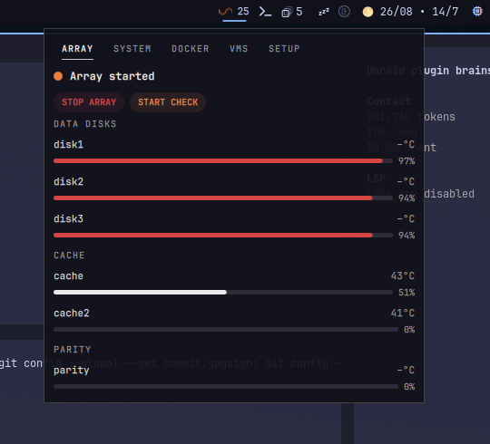

# Unraid

An Omarchy Quickshell plugin that monitors and manages an Unraid server from
the bar, over the native Unraid GraphQL API (Unraid 7.2+). Optional: launch
container WebUIs and open VM consoles (VNC/SPICE) directly in app windows.



# Video

https://github.com/user-attachments/assets/944ab549-4224-49f4-8716-c34aeb8b98aa

## Install

From the plugin repository:

```bash
omarchy plugin add https://github.com/tuthan/omarchy-unraid.git --enable
```

For local development:

```bash
plugin_dir="$HOME/.config/omarchy/plugins/io.github.hvo.omarchy-unraid"
mkdir -p "$(dirname "$plugin_dir")"
if [ -L "$plugin_dir" ]; then unlink "$plugin_dir"; fi
mkdir -p "$plugin_dir"
rsync -a --delete --exclude='.git/' "$PWD"/ "$plugin_dir"/
omarchy-shell shell rescanPlugins
omarchy plugin enable io.github.hvo.omarchy-unraid --section right
```

Omarchy expects a real plugin directory, so this setup copies the repository
into the plugin directory instead of symlinking it. The `.git` directory is
excluded because it is not needed by the runtime and may be protected by
Omarchy. After making source changes, rerun the `rsync` command and
`omarchy-shell shell rescanPlugins`, then `omarchy restart shell` if the bar
widget does not pick up the change.

The plugin requires `curl` for API calls.

## Update

For a plugin installed from GitHub, update it with:

```bash
omarchy plugin update io.github.hvo.omarchy-unraid --yes
omarchy restart shell
```

For local development, recopy the repository into the real plugin directory
and rescan it:

```bash
rsync -a --delete --exclude='.git/' "$PWD"/ "$HOME/.config/omarchy/plugins/io.github.hvo.omarchy-unraid"/
omarchy-shell shell rescanPlugins
```

## Setup

Open the panel and switch to the **Setup** tab:

- **Server URL** — host or base URL of the Unraid server, for example
  `tower.local` or `192.168.1.10`. The plugin appends `/graphql` when needed.
- **Transport** — HTTPS is selected by default and verifies the server
  certificate. HTTP is available as an explicit opt-in for Unraid setups that
  do not accept API keys on their HTTPS listener; HTTP sends the API key in
  cleartext and should only be used on a trusted network.
- **Self-signed HTTPS certificate** — off by default. Enable this only when
  the HTTPS endpoint uses a certificate you trust; it disables certificate
  verification for the API requests.
- **API key** — create one under Unraid web UI → Settings → Management
  Access. The key needs read access; management actions additionally need
  write roles for Docker, VMs, array, and parity check.
- **Poll interval** — seconds between bar refreshes (default 30).
- **Management** — off by default. When enabled, start/stop actions become
  available for containers, VMs, the array, and parity checks. Destructive
  actions confirm inline: the button turns into `CONFIRM?` for four seconds;
  click again to fire.
- **VM console (SSH)** — off by default. When enabled, running VMs get an
  `Open Console` button. The plugin runs a **read-only** `virsh dumpxml`
  over SSH to find the VM's VNC/SPICE ports and opens the server's own
  console page in an app window. Setup: install
  `~/.ssh/id_ed25519_unraid.pub` as an authorized key for the SSH user
  (`root` by default) on the Unraid server. The API never starts or stops a
  VM for this; ports are fetched per click and never stored.
- **Theme** — Unraid brand colors (orange accent) by default, or follow the
  Omarchy palette.

Settings are stored in `~/.config/omarchy/shell.json` under the widget's bar
entry and survive restarts.

## Panel tabs

- **Array** — per-disk usage bars, temperature, and status for data disks,
  cache pools, and parity; array start/stop and parity check
  start/pause/resume/cancel when management is enabled.
- **System** — CPU and memory usage history graphs with a per-core breakdown,
  uptime, parity check status (last run, duration, errors), hottest disk
  temperature, and a link to open the Unraid web dashboard.
- **Docker** — container list with state, autostart, and (for running
  containers with a valid WebUI URL from the container template) an
  `Open WebUI` action with the resolved LAN destination; start/stop/restart
  per container when management is enabled.
- **VMs** — virtual machine list with state; start/stop per VM when
  management is enabled.
- **Setup** — configuration as described above.

## Launching WebUIs

Running containers can be opened directly in an app window when the Unraid
API reports a WebUI URL for the container template. Behavior and limits:

- **Optional API fields.** On the first poll of each connection the widget
  probes the API for the optional `webUiUrl` field. Server builds or API key
  roles that do not expose it keep monitoring but show no per-container WebUI
  buttons; the tab-level **Open Unraid Docker** link remains available.
- **Destination fidelity.** The container's own URL — scheme, host, port,
  path, query string, and fragment — is preserved exactly. Template
  destinations may point at a LAN host that is unreachable from the current
  network; the plugin shows the destination but never rewrites it. Published
  ports are informational and never used to construct launch URLs.
- **Browser authentication and TLS are separate.** Launching the app does
  not prove the page connected or authenticated: browser login, certificate
  warnings, and target reachability are handled by the browser. The API
  key and the self-signed-certificate setting apply to API calls only; the
  plugin never adds API headers or keys to a launched destination.
- **Launch handling.** Each launch runs the `omarchy-launch-webapp` helper
  with the validated URL as a single argument (no shell). If the launch
  cannot be confirmed, the panel offers an **Open in browser** fallback for
  the same destination. Closing the panel does not terminate a launched app.
- **Unraid page links.** `Open Unraid Docker` and `Open Unraid VMs` open the
  server's Docker and VM pages; they work with management disabled.
- **VM console (VNC/SPICE), optional.** The Unraid GraphQL API does not
  expose VM graphics data at any build, so the plugin discovers console
  ports read-only over SSH (`virsh dumpxml`) when the feature is enabled in
  Setup. The console itself opens the server's `vnc.html`/`spice.html` page
  through its websocket proxy (`/wsproxy/<port>/`), exactly like the Unraid
  web UI does — your normal Unraid browser login applies, and SPICE VMs use
  the same flow. VMs without a VNC/SPICE graphics device, or stopped VMs,
  show no console button. Console discovery never boots a VM and never uses
  `domain-start-console`. Without the SSH key there is no direct console
  link — the console port is only readable by the webgui session itself;
  use the `Open Unraid VMs` page and its per-VM console menu instead.
- **No focus reuse.** Every click launches its destination in a fresh app
  window; reusing an existing window is intentionally not implemented
  (app-class identity across ports is unreliable).

## Keyboard

- `1`–`5` switch tabs
- `←`/`→` cycle tabs
- `↓`/`↑` or `j`/`k` scroll the panel one list row at a time
- `R` refresh
- `Esc` close

## Behavior

- The bar pill shows the Unraid mark with the number of running containers;
  an orange/red dot appears next to it when the array is degraded, containers
  are dead, or the API is unreachable. Hovering shows a one-line summary.
- History graphs accumulate one point per poll (up to 90 points) and survive
  panel open/close.
- Parity history and uptime are fetched on demand when the System or Array
  tab opens, not on every poll.
- `RESTART` on a container is emulated as a chained stop followed by start,
  because the restart mutation is not available on current Unraid API builds.
- Container and VM lists render through recycling `ListView`s. Mouse-wheel
  speed follows Qt's flick-deceleration constant; this session tunes it via
  `QT_QUICK_FLICKABLE_WHEEL_DECELERATION` (see `~/.config/uwsm/env.d/`), and
  `↓`/`↑` or `j`/`k` scroll one row per press regardless.
- Helper checks for the launch helpers live in
  `tests/remote-console-access.test.cjs` (`node --test
  tests/remote-console-access.test.cjs`); they validate URL parsing, query
  composition, and response mapping without contacting a server.
- Reboot/shutdown are not implemented: the Unraid GraphQL API does not expose
  them yet.
- With multiple monitors, each bar widget targets its own server connection
  and the panel opens anchored to the clicked widget.

## Remove

```bash
omarchy plugin remove io.github.hvo.omarchy-unraid
```

## License

MIT
